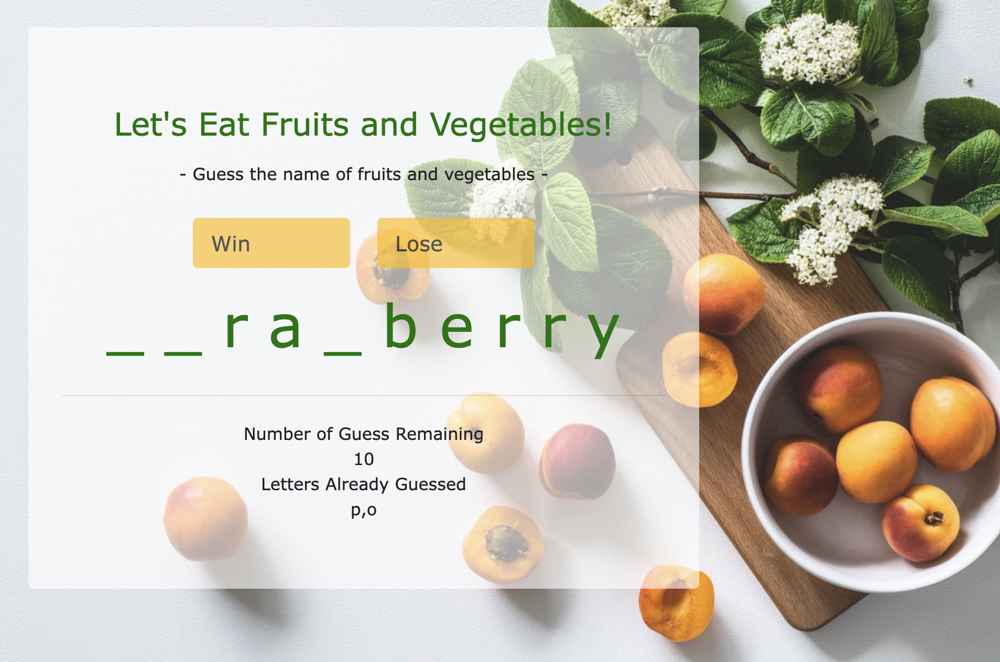

# Word Guess Game
Developed a word guessing game using HTML, JavaScript, and CSS.

## Rules
- You can guess one letter at a time.
- If the guessed letter is in the word, it will be revealed in all its correct positions.
- If the guessed letter is not in the word, it counts as a wrong guess.
- You have 12 chances (wrong guesses) to guess the word.
- You win the game if you correctly guess all the letters in the word before running out of chances.
- You lose the game if you use up all 12 chances without guessing the word.

## Play the game now!
[Go to the game](https://nnjh12.github.io/Word-Guess-Game/) 
 

